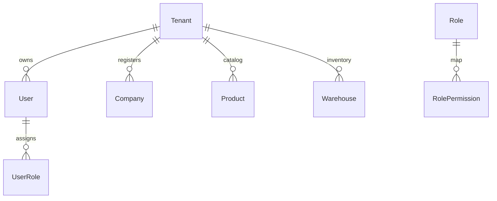

# Amdox ERP Database Schematics & Relationships

Entities relationships and database tables indices definitions.

---

## 1. Schema ER Model

---

## 2. Seed & Migration Strategies
- **Migrations**: Incremental schema updates executed via Prisma migrate CLI (`prisma migrate deploy`).
- **Seeders**: Seed system permissions first, then execute `demo-seeder.ts` to construct the testing ecosystem.
