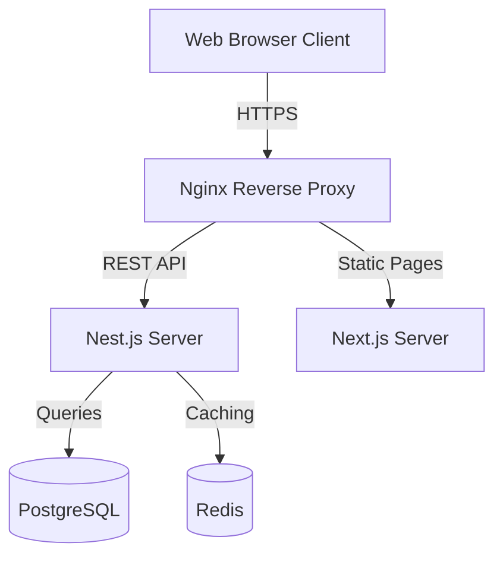

# Amdox ERP Developer Architecture Guide

Technical blueprints for backend APIs, frontend rendering, and monorepo workspace dependencies.

---

## 1. Monorepo Structure
- `apps/backend`: Nest.js server exposing REST APIs.
- `apps/web`: Next.js frontend rendering dynamic pages.
- `packages/database`: Prisma schema definition and migration logs.
- `packages/config`: Common build and runtime environment values.

---

## 2. Infrastructure Flow

---

## 3. Workflow Engine
- Implements state transition pipelines (Draft $\rightarrow$ Pending Approval $\rightarrow$ Confirmed/Rejected).
- Triggers notifications, logs audits events, and runs database transaction lockouts on approval.
